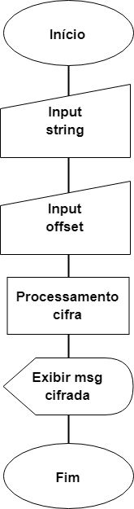

# Cifra de César

## Prefácio

Já que usa o celular de sua mãe, meu afilhado queria conversar comigo em código para
que ela não soubesse sobre o que estávamos falando. Pensando nisso, criei essa aplicação
para enviarmos mensagens secretas um para o outro.

## Introdução

Para enviar as mensagens em código, desenvolvi a aplicação com base na Cifra de César,
um dos primeiros tipos de criptografias do mundo. Essa cifra troca as letras da ordem
do alfabeto normal levando em consideração um valor de deslocamento fixo. A mensagem
original é substituída pelas letras equivalentes aplicando o deslocamento.

Essa criptografia recebe o nome do imperador Júlio César, que deslocava 3 posições
as letras do alfabeto para enviar mensagens aos seus generais em guerra.

Exemplo utilizando um deslocamento de 4 posições:
- Mensagem original: AMARELO
- Mensagem codificada: EQEVIPS

## Objetivo

O objetivo principal dessa aplicação é criar mensagens em código com letras maiúsculas 
e minúsculas a partir de um valor de deslocamento determinado pelo usuário.
Além da codificação, o usuário pode também inserir a mensagem codificada para ser decodificada
utilizando o mesmo deslocamento realizado para cifrar a mensagem.

O programa não funciona utilizando caracteres especiais ou com deslocamento negativo.

## Definição do usuário
Essa aplicação destina-se a qualquer pessoa que deseje enviar a alguém uma mensagem em código para
que ninguém além do destinatário saiba o seu conteúdo. 

## Diagrama de blocos

